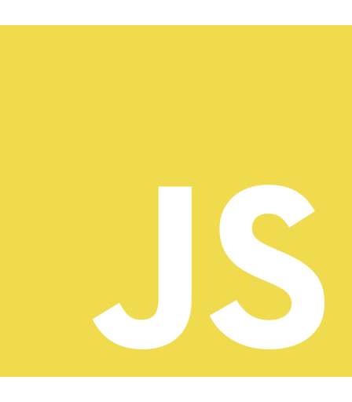
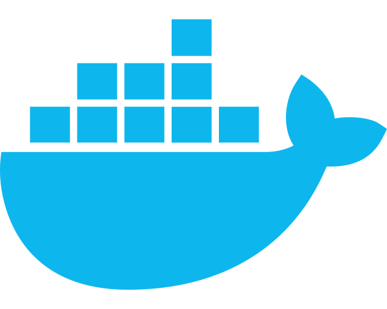

### Hi there 👋🏽

I'm Timi, a software developer and SEO specialist with an eye for good design.
 

**About me**

- 👨🏽‍💻 I’m currently working on building bespoke WordPress projects and integrating AI for businesses
- 📱 I’m currently learning DevOps and Flutter
- 👯 I’m looking to collaborate on open source backend projects or AI-related projects
- 🤔 I’m looking for help with DevOps
- 💬 Ask me about Custom WordPress Development, Marketing Strategies, and Product Development
- 📫 How to reach me: hi@temak.dev

<code></code>
<code></code>
<code></code>
<code></code>

 

